# 2025's Top 15 Best AI Course Creation Tools

Creating online courses from scratch takes weeks of planning, scripting, recording, and editing before you even reach your first student. Traditional course authoring tools require technical skills most subject matter experts don't have, and hiring production teams burns through budgets faster than enrollment fees can recover. AI course creation platforms eliminate these bottlenecks by generating course structures, content drafts, quizzes, and even videos in minutes rather than months. Whether you're an educator digitizing curriculum, a consultant packaging expertise, or a company training employees, the right AI course creator transforms your knowledge into engaging learning experiences without the usual complexity.

## **[Coursebox](https://coursebox.ai)**

Complete AI course authoring combined with full LMS capabilities in one platform.

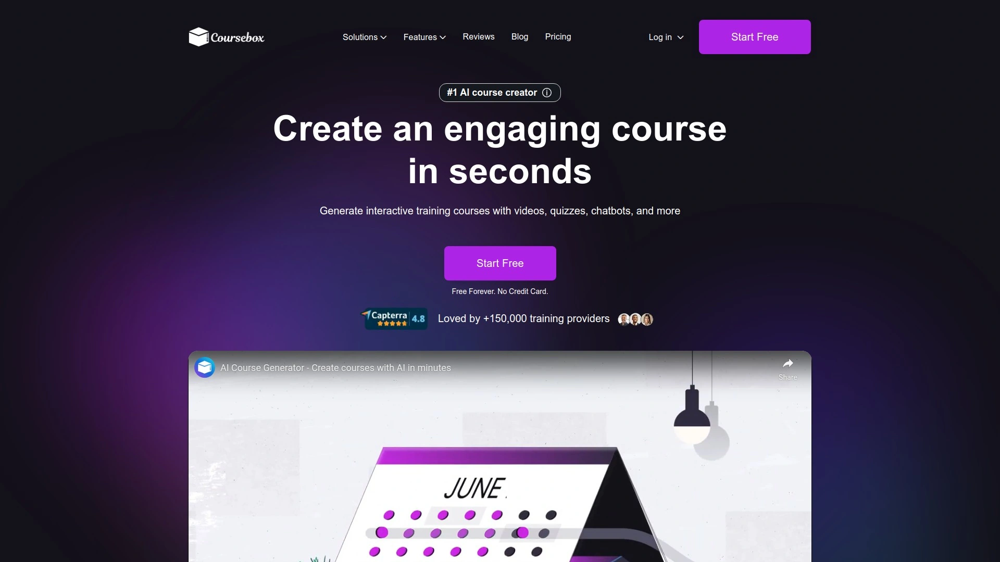

Coursebox operates as both course creator and learning management system, removing the need for separate tools. You convert existing videos, documents, or websites into structured courses automatically, or align content with competency standards for professional training requirements. The platform generates training videos using AI in minutes instead of requiring expensive production teams and editing software. Instant AI grading evaluates learner responses based on your marking rubric and provides immediate feedback, while an interactive chatbot trained on your entire course offers 24/7 conversational assistance to students. Quiz generation happens in seconds with correct and incorrect answer options ready to use. You can set individual course prices or sell ongoing training subscriptions to scale revenue streams. The system creates interactions like flashcards, tabs, accordions, and supports SCORM embedding for integration with existing systems. AI assists with course structure design before generating content drafts that you refine through an easy editor. White-label branding applies to your training platform, mobile app, and courses for seamless learner experience. Over 150,000 training providers use the platform, with some reporting it's "a thousand times faster" than previous course builders. Automated certificates, tutoring, and grading deliver instant rewards to students rather than making them wait days for instructor responses. Free plan allows creation of three courses, with paid plans starting at $10 monthly.

## **[Mindsmith](https://www.mindsmith.ai)**

Next-generation eLearning development accelerating creation up to 12x faster.

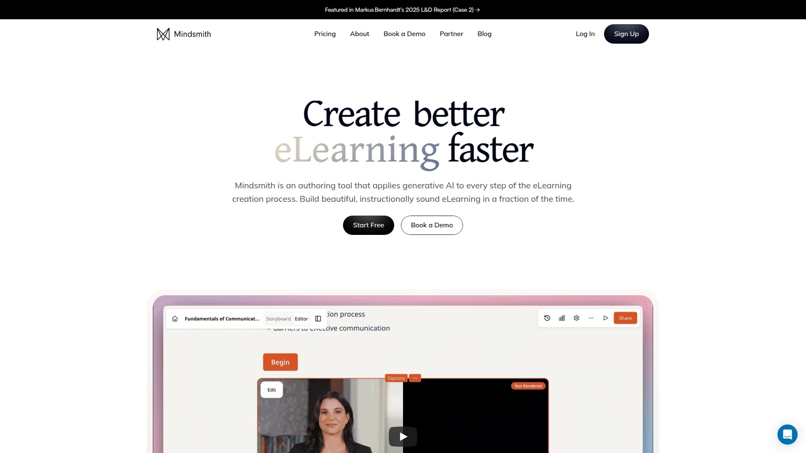

Mindsmith transforms any document into eLearning content through AI-powered storyboards that let you guide the generation process with specific instructions or follow source materials verbatim. The platform converts SOPs, web articles, presentations, and course outlines into interactive learning experiences. Real-time collaboration allows teams to work simultaneously on content, with commenting features for review workflows. Customization matches your organization's brand standards automatically. You create quizzes, branching scenarios, accordions, and flashcards without coding. Content shares via auto-updating SCORM packages, xAPI, or direct links, with dynamic language support working in 30+ languages simultaneously. WCAG 2.2 compliance ensures accessibility, and the platform includes advanced branding capabilities plus centrally managed team administration. Your content never trains AI models, addressing common enterprise security concerns. The AI assistant handles menial editing tasks like transforming interactive types, adding pages, and editing copy while maintaining lesson context. Short answer questions receive AI-driven grading based on parameters you set, significantly reducing manual grading time. Over 16,000 eLearning designers use Mindsmith, with HubSpot instructional designers praising its approach to course creation and responsive team. Professional plan costs $39 monthly after two free shared lessons.

## **[iSpring Learn](https://www.ispringsolutions.com)**

Integrated authoring tool with comprehensive automation for business training.

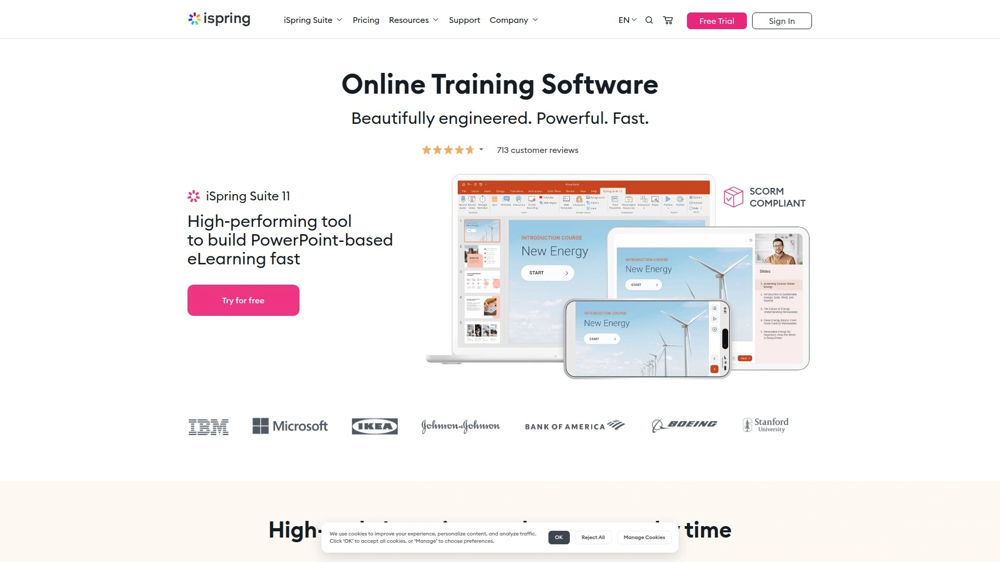

iSpring Learn combines LMS functionality with iSpring Suite authoring tool, letting you create courses, quizzes, simulations, and training videos directly in PowerPoint. The integrated AI assistant generates course text, corrects grammar errors, and creates course outlines automatically. An AI chatbot answers technical questions about using the LMS, eliminating tech support wait times. Automation handles employee enrollment, reenrollment, deadline reminders, and upcoming event invitations without manual intervention. The platform provides 20+ real-time and scheduled reports tracking learning progress and outcomes. Structured learning tracks guide employees through required training sequences. Blended learning support combines online and in-person instruction. 360-degree feedback assessments evaluate competencies from multiple perspectives, while observation checklists track on-the-job training completion. Top-rated customer support consistently earns recognition from users. The system works for businesses of any scale, from small companies to enterprises. No multitenancy or discussion forums, keeping the platform focused on core training functionality. Pricing ranges from $2.94 to $6.64 per user monthly, with 30-day free trial available.

## **[Courseau](https://courseau.co)**

AI-first training platform creating courses from diverse source materials.

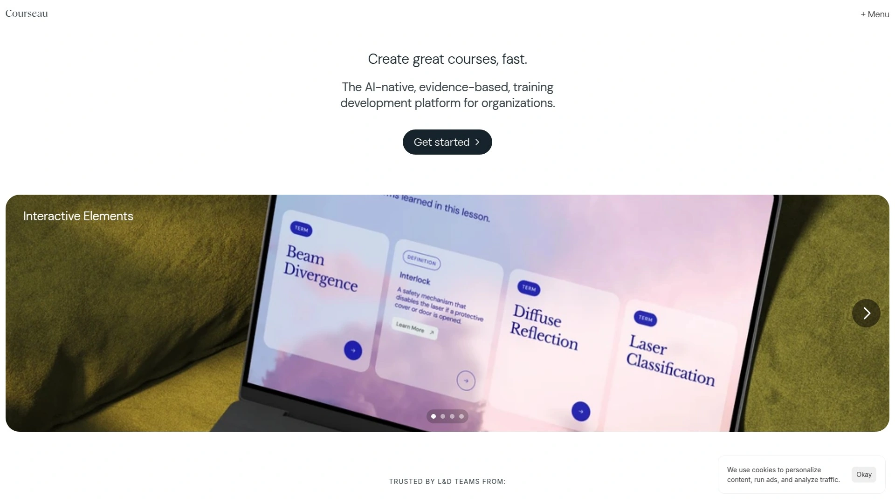

Courseau produces course outlines and first drafts from your input sources in minutes, letting you define learning objectives and learner profiles before generation begins. You add documents, links, or text as source material, then set parameters like tone of voice. The platform creates quizzes, key takeaways, flip cards, examples, and actionable steps alongside main content. Published courses export as SCORM files for LMS upload, or share via link and website embeds. The ability to review and refine course outlines before full generation gives you control over structure. Learning objectives map to content automatically, ensuring alignment with training goals. SCORM and PDF export options provide flexibility for different delivery methods. The platform lacks payment gateway and marketing tools, requiring export to systems like Kajabi or Shiken for monetization. AI image generation requires higher-tier plans. Best suited for learning and development teams with existing distribution channels who need efficient content creation rather than end-to-end course business management. Trial accounts available on request, with paid plans starting at $99 monthly.

## **[Teachable](https://teachable.com)**

Straightforward course delivery with guided setup for beginners.

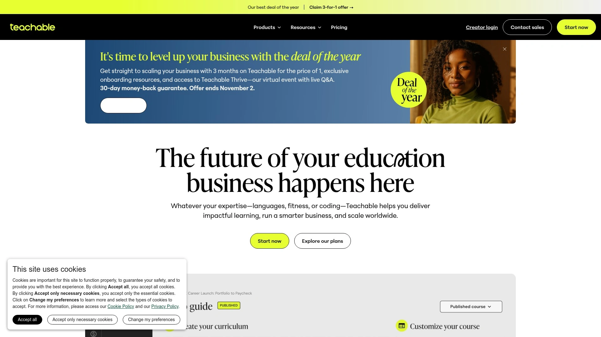

Teachable excels at simple course creation through guided processes that walk you through each step. The platform hosts courses, processes payments, and manages students without technical complexity. AI course creator generates full course outlines from title and description, which you can customize completely. Multiple content types including video, audio, images, documents, text, and quizzes combine within single lectures for flexible organization. Built-in sales pages convert visitors into students, and payment processing handles transactions through Stripe and PayPal. Email marketing tools communicate with students and promote courses. Free plan covers one published product of each type, with paid plans starting at $39 monthly. Transaction fees apply on basic plan, increasing to 5% of sales before upgrading. Certificate generation rewards course completion. The platform focuses on course delivery rather than advanced features, making it approachable for first-time creators. Over 150,000 creators and businesses trust Teachable to build, sell, and scale courses, memberships, and digital products. Lacks built-in marketing automation and sales funnel tools compared to premium alternatives, but simplicity attracts users prioritizing ease over comprehensive features.

## **[Thinkific](https://www.thinkific.com)**

Highly customizable course design with zero transaction fees.

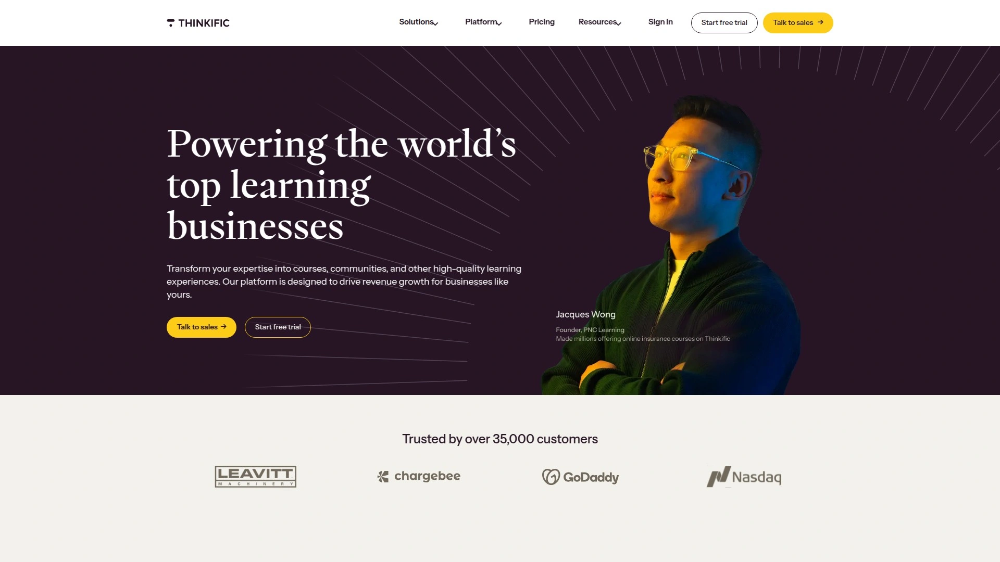

Thinkific removes transaction fees that competitors charge, letting you keep full revenue from sales. Drag-and-drop course builder creates courses without coding, with extensive customization matching your brand identity. Student engagement tools including quizzes, surveys, and certificates boost completion rates. Email automation features built into the platform eliminate need for third-party marketing tools on higher plans. Plans support unlimited courses and students on mid-tier options, removing scaling concerns. Site builder creates branded websites for your course business. Membership features enable recurring revenue models. Starting price of €36 monthly positions it competitively for entrepreneurs and small businesses. The platform emphasizes control over course presentation and branding more than competitors. Community features connect students for peer learning. Bulk enrollment handles corporate training scenarios. Certificates customize with your branding and instructor signatures. Advanced features like priority support and removing Thinkific branding require higher-tier plans. Best suited for creators wanting professional appearance and full revenue control without technical complications.

## **[Kajabi](https://www.kajabi.com)**

All-in-one platform with built-in marketing automation and sales funnels.

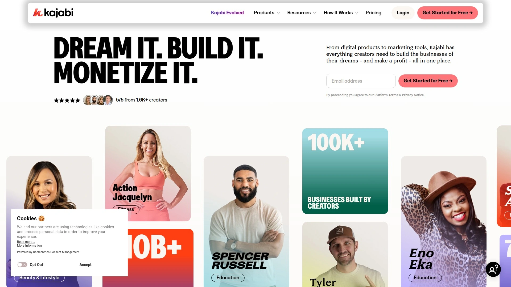

Kajabi bundles course hosting, website building, email marketing, sales funnels, and membership features into single subscription, eliminating need for multiple tools. Built-in sales funnels automate marketing with email sequences and conversion pipelines. Website builder creates branded sites without coding knowledge or external services. Podcast hosting adds another engagement channel for audiences. Course generator produces outlines from title and description that you adapt to your needs. 0% transaction fees apply across all plans, preserving revenue from sales. Automated upsells and built-in system often increase average order value by 20-30% according to creator reports. The platform accepts 95+ currencies with automated tax handling. Kickstarter plan starts at $71 monthly when paid annually, scaling to Pro plan at $319 monthly with expanded features. Integration ecosystem connects with other business tools. Analytics track student progress and business metrics. The comprehensive feature set justifies higher pricing for serious course businesses and established creators but represents overkill for beginners testing ideas. Learning curve steeper than simplified platforms, though support resources extensive.

## **[LearnWorlds](https://www.learnworlds.com)**

Interactive course builder with deeply embedded AI assistance throughout platform.

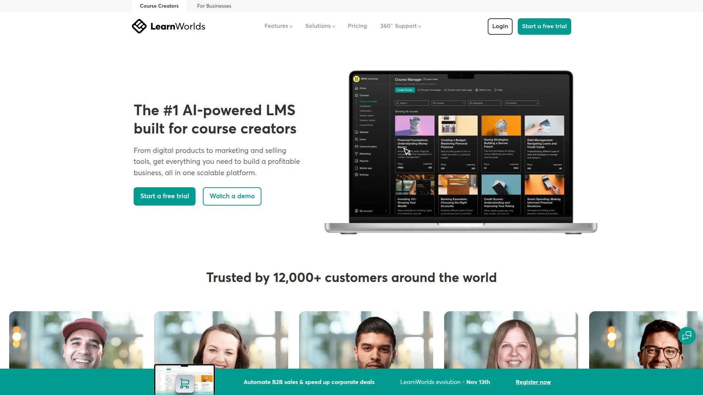

LearnWorlds integrates AI across every phase of course creation, from generating SMART learning objectives to creating Socratic dialogues and dilemmas for engagement. The platform builds structured learning with assessments, learning paths, and professional training features. Interactive video tools add in-video quizzes, clickable CTAs, and automatic transcripts making learning active rather than passive. SCORM support makes it essential for corporate and professional training requiring standards compliance. Content dripping schedules lesson release over time, and prerequisites enforce sequential learning. Live sessions, modules, quizzes, assignments, surveys, and certificates create comprehensive educational experiences. AI Assistant generates course outlines, improves lesson flow, writes engaging titles, and optimizes sales pages. Plans start at $29 monthly when billed annually. The platform emphasizes engagement and interactivity over simple video hosting. Social learning features enable student discussions and peer interaction. White-label options remove LearnWorlds branding on premium plans. Mobile apps keep learners connected across devices. Designed for creators caring about educational structure and professional polish beyond basic content delivery.

## **[Mini Course Generator](https://minicoursegenerator.com)**

Fast interactive micro-courses using simple card-based structure.

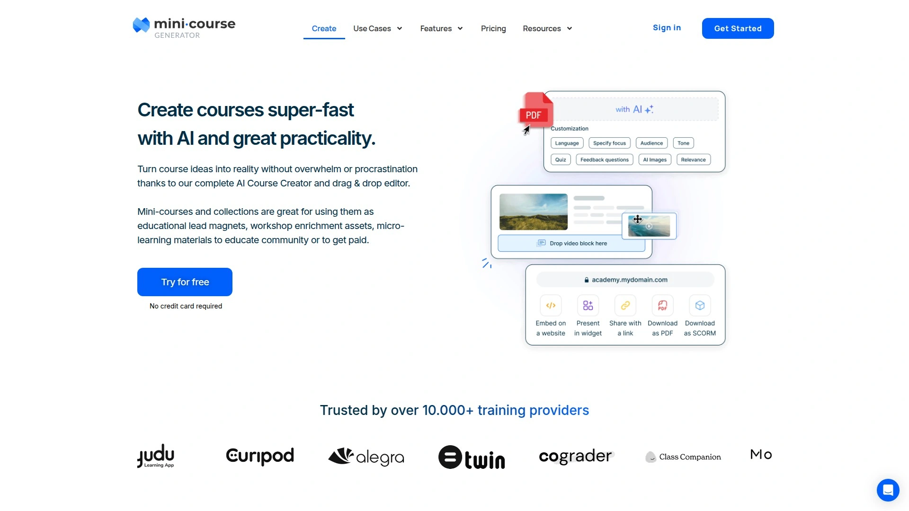

Mini Course Generator specializes in bite-sized learning experiences through streamlined page structure avoiding traditional course builder complexity. You start with a topic or upload content, and AI generates structured materials, images, and quizzes automatically. Intuitive drag-and-drop editor and AI assistant guide complete beginners through the process without prior course creation experience. Strategic AI placement throughout the platform assists when needed while you maintain full creative control. The "mini" approach focuses on quick-win learning rather than comprehensive programs, ideal for lead magnets, employee onboarding modules, or supplementary training. AI-generated assessments test comprehension without manual question writing. Customization matches your brand and teaching style. Three mini-courses available free, with paid plans starting at $15 monthly. The card format works well on mobile devices for on-the-go learning. Best for creators wanting to produce targeted training modules quickly rather than building extensive curriculum. Content exports for use in other systems or embeds directly on websites.

## **[Shiken](https://shiken.ai)**

AI voice agent accelerating course creation by 70% with built-in marketplace.

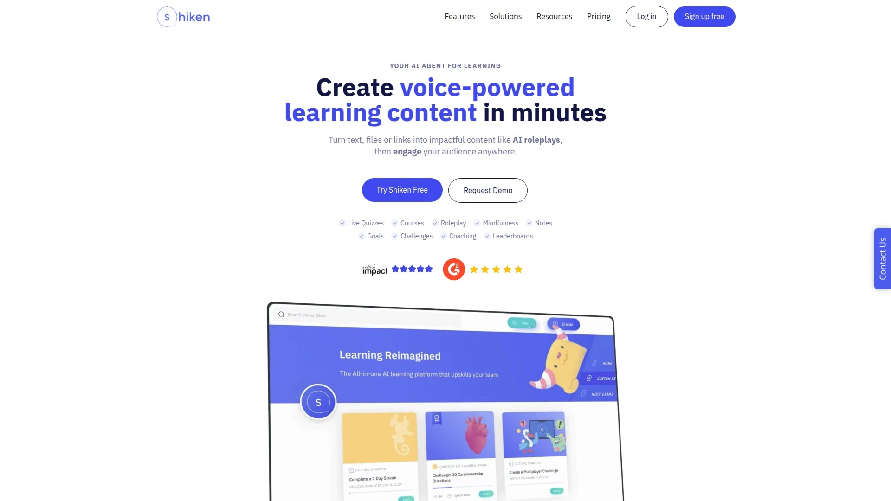

Shiken converts existing content from uploaded documents, pasted text, or URLs into complete courses combining text, YouTube videos, and tests at the end of each chapter. Generation happens in background, sending email notifications when courses finish processing in just a few minutes. You align courses to particular skills and select question types including single-best-answer quizzes and role-play scenarios for language or sales training. Creators sell courses on Shiken's built-in store similar to Skillshare or Udemy, reaching new audiences beyond your own following. Card-based courses and resources centralize team knowledge. SCORM export available on higher tiers for enterprise LMS integration. Pricing starts at £39 monthly after 14-day free trial. Mobile-friendly interface enables learning anywhere. The combination of course creation, hosting, and marketplace distribution differentiates Shiken from creation-only tools. Gamification elements maintain learner engagement. AI grading evaluates exam answers automatically. Best for creators wanting all-in-one solution including audience access rather than just authoring tools.

## **[CourseAI](https://courseai.com)**

Streamlined platform lowering barriers for first-time course creators.

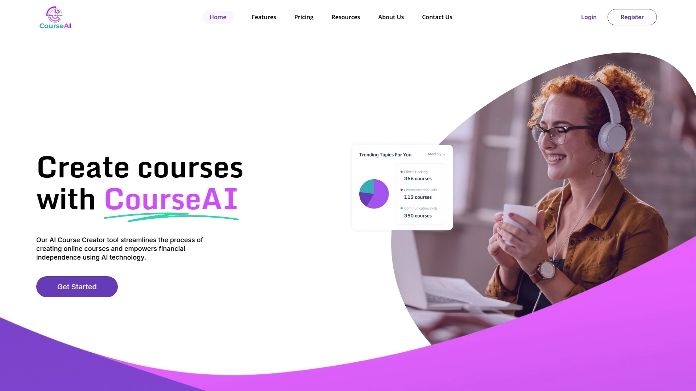

CourseAI focuses on simplifying the entire process from content generation to hosting and learner promotion, specifically targeting people new to online education. The AI eliminates manual work by automating course design, generating outlines, and producing initial content drafts. You customize generated material to match your expertise and teaching style. Hosting included means no separate services required for course delivery. Built-in promotional tools help attract learners to your content. The platform streamlines the path from idea to published course, removing technical obstacles that stop potential creators. Pricing set at $29.99 monthly makes it accessible for individual creators testing course business viability. Best suited for subject matter experts who know their content but lack technical skills or time for traditional course production. The simplified approach trades advanced customization for speed and ease of use. Automated features handle routine tasks while you focus on content quality and student interaction.

## **[Heights AI](https://www.heightsplatform.com)**

Comprehensive automation helping creators plan, market, and scale courses.

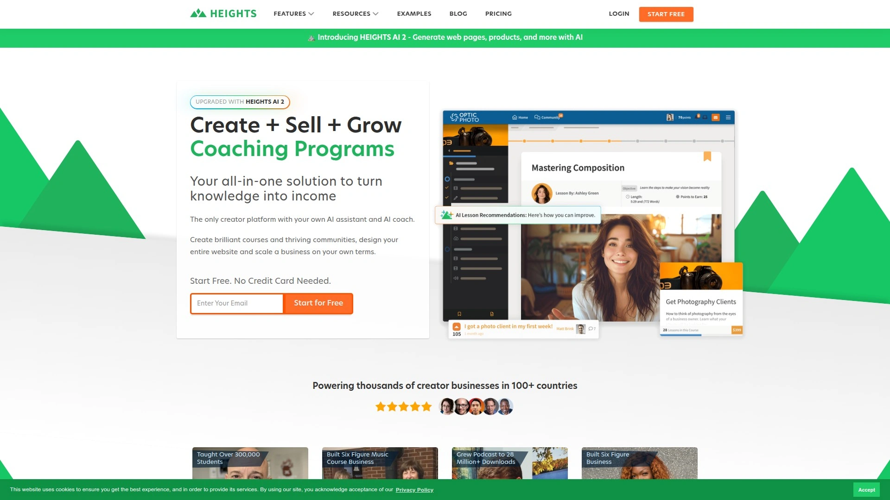

Heights AI positions itself as a full team of assistants managing course development and business operations. AI-powered course creation generates outlines in clicks by simply describing your topic—say "teaching photography basics" and the system produces full course structure with lesson titles, descriptions, and recommended topics. The platform handles website design, checkout pages, and marketing setup automatically. Course creation tools combine with digital product sales features, letting you monetize multiple revenue streams. Plans start at $19 monthly for basic functionality. Marketing automation promotes courses to target audiences. Student management tracks progress and engagement. The system saves hours on structural planning that traditionally consumes creators' time. Email marketing integrations communicate with students throughout their learning journey. Best for creators wanting automation across both course development and business management rather than focusing solely on content creation. Mobile apps deliver learning on any device.

## **[Lingio](https://www.lingio.com)**

Mobile-first gamified training for frontline and deskless workers.

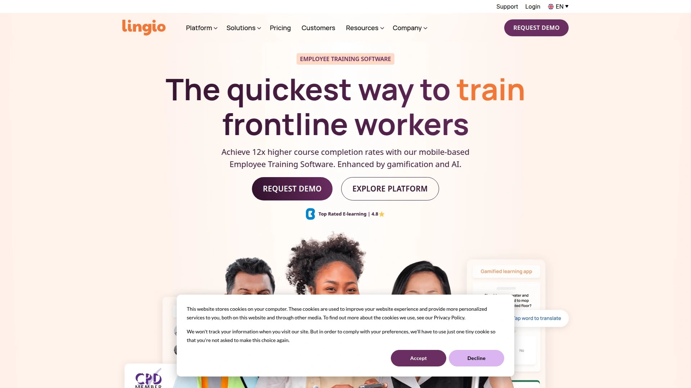

Lingio targets industries with deskless workforces including home care, cleaning, facility management, hospitality, and transportation. Upload training materials and AI Course Creator instantly converts them into engaging interactive courses. AI-generated assessment questions and relevant images customize content automatically. Gamification elements developed by teams from EA Games and Spotify make training memorable through storylines, interactive quizzes, and points systems. Research since 2019 shows 12x higher course completion rates compared to other products. Mobile-first format ensures accessibility for employees without desk access. Translation supports over 100 languages including industry-specific terms, breaking language barriers for diverse workforces. Reliable AI uses only trusted sources and your organization's existing documents, with human editors verifying AI-generated content before publishing. Coaching portal tracks training outcomes in real time with mobile-friendly interface ensuring high engagement. Suitable for onboarding, compliance training, internal instructions, customer support training, and leadership development. Pricing starts at $416 monthly targeting mid-size to large organizations. Partnership with International Association of Accessibility Professionals ensures inclusive learning.

## **[StudyRaid](https://studyraid.com)**

Free AI course creator with AI-graded exams for rapid simple course development.

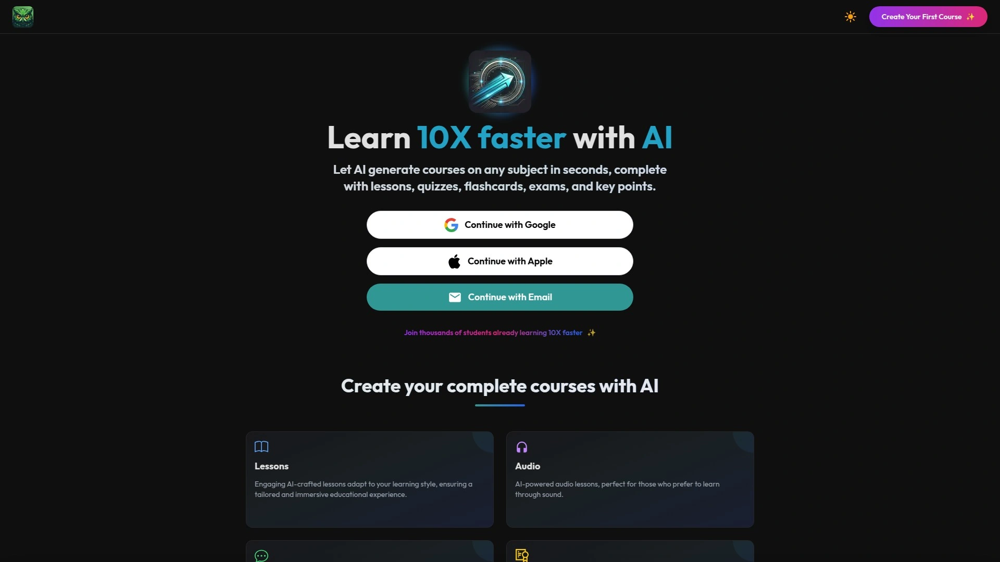

StudyRaid generates complete courses on any subject in seconds by simply entering the topic to be mastered. Courses include lessons, quizzes, flashcards, and key points automatically. Realistic exams feature AI-graded answers removing manual evaluation work. AI-generated lesson narrations add audio dimension to text content. The platform suggests related questions and creates dedicated courses for deeper understanding when learners need additional context. Free version provides full access to core features, with premium pricing available on request for advanced needs. Best suited for educational content and knowledge sharing rather than business training or monetized courses. Interface prioritizes speed and simplicity over extensive customization. Ask-questions feature provides precise answers helping learners clarify concepts. The completely free tier removes financial barriers for students and teachers wanting AI-assisted learning tools.

## **[Disco](https://www.disco.co)**

AI tutor integration with advanced learning content creation capabilities.

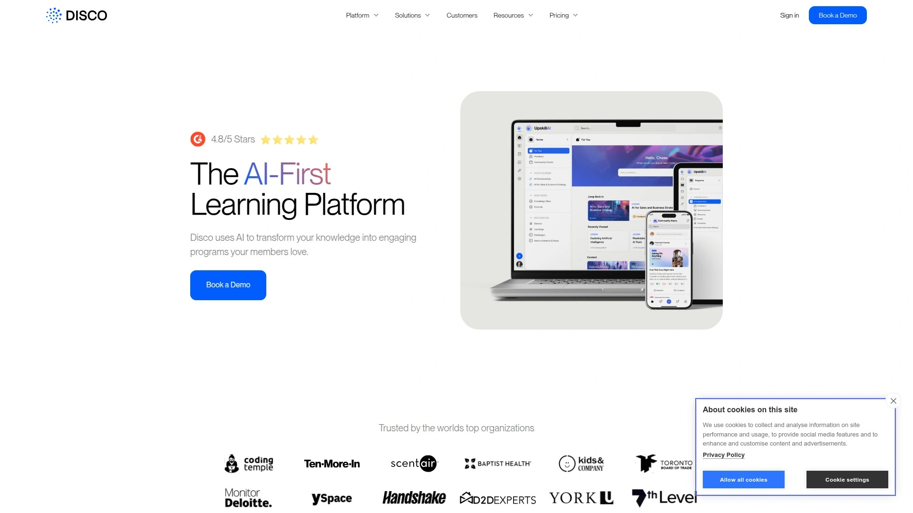

Disco combines course creation tools with AI tutor functionality, providing both content authoring and intelligent learner support. The platform emphasizes community and cohort-based learning alongside self-paced courses. AI helps generate learning content and training materials while the AI tutor assists students through their educational journey. Social learning features connect learners for collaborative experiences. Event management handles live sessions and workshops. Pricing starts at $359 monthly, positioning Disco for established training businesses and educational institutions rather than individual creators. The platform targets organizations wanting comprehensive learning ecosystems with AI-powered personalization. Best for companies prioritizing learner interaction and community building alongside content delivery. Analytics track engagement and learning outcomes across cohorts.

## FAQ

**How long does it actually take to create a complete course using AI tools?**

Most AI course creators generate initial course structures and content drafts in 3-10 minutes after you provide the topic and source materials. Coursebox and Shiken typically complete background generation in under five minutes, while more comprehensive platforms like Mindsmith may take slightly longer for complex branching scenarios. You'll need additional time to review, customize, and add your personal expertise—plan 1-2 hours total for a basic course or 4-6 hours for more polished professional training.

**Can I use AI-generated courses for corporate compliance training?**

Yes, several platforms specifically support compliance training requirements. iSpring Learn, Mindsmith, and LearnWorlds offer SCORM export and standards compliance needed for regulated industries. Lingio includes features for verified training documentation and trackable completion required by HR departments. Make sure to review AI-generated content for accuracy against your specific compliance requirements, and use platforms that let human experts verify content before publishing to employees.

**Do these platforms work if I already have course content that needs converting?**

Absolutely—many platforms excel at converting existing materials. Coursebox transforms videos, documents, and websites into structured courses automatically. Mindsmith converts SOPs, presentations, and web articles into eLearning content. Shiken accepts uploaded documents, pasted text, or URLs as source material. This conversion capability saves months of manual restructuring when you have expertise documented in various formats but need it organized as formal training.

## Conclusion

Building professional online courses no longer requires months of production time or specialized technical skills. The platforms above handle everything from content generation to student management, with options ranging from free tools for simple courses to enterprise solutions for scaled training operations. [Coursebox](https://coursebox.ai) delivers the most complete solution by combining AI course authoring with full LMS functionality in one platform, eliminating the tool-switching that slows down training providers who need both creation and delivery capabilities. The instant AI grading and 24/7 chatbot support create engaging learner experiences while automated systems handle administrative tasks, letting you focus on content quality rather than technical management.
